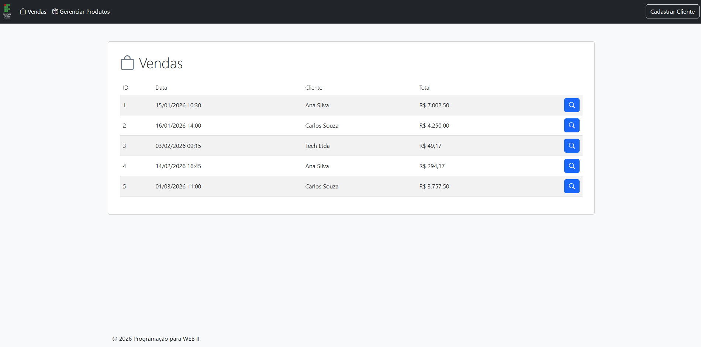
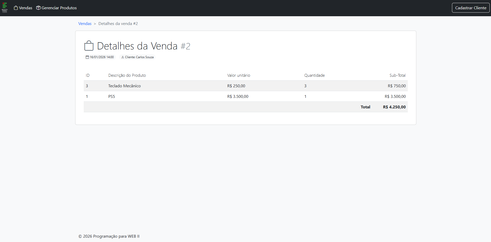
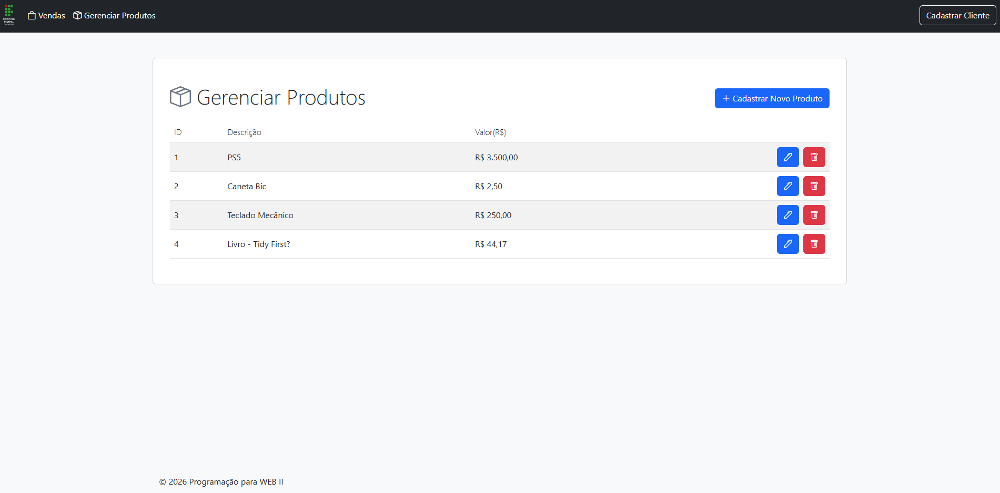
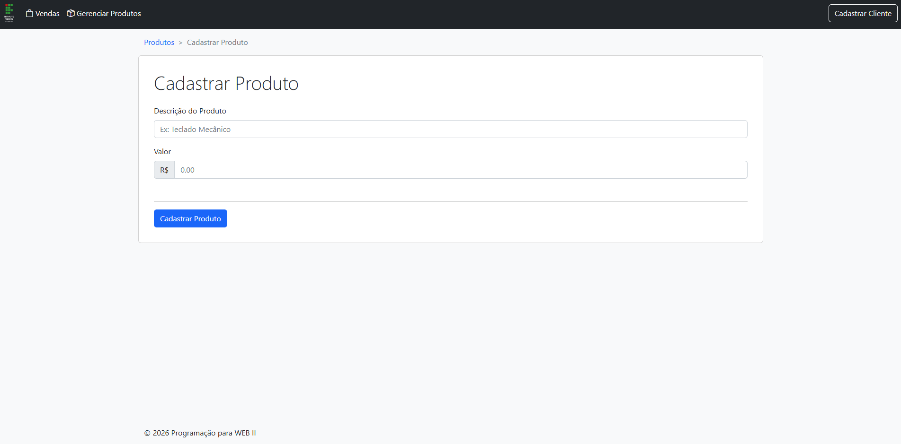
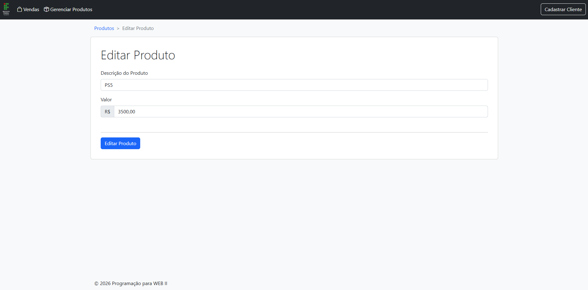
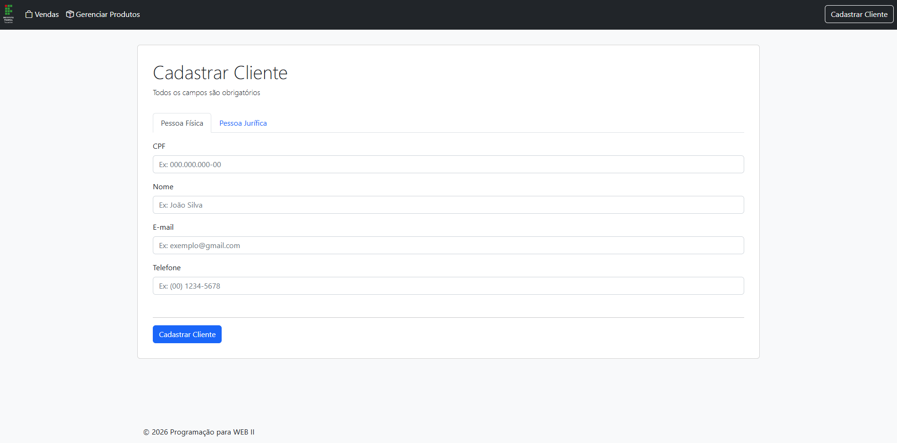

# 🛒 E-commerce Básico - Java Spring Boot

[](https://www.oracle.com/java/)
[](https://spring.io/projects/spring-boot)
[](https://spring.io/)
[](https://hibernate.org/)
[](https://jakarta.ee/specifications/persistence/)
[](https://www.thymeleaf.org/)
[](https://getbootstrap.com/)
[](https://www.h2database.com/)
[](https://maven.apache.org/)

Sistema web de e-commerce desenvolvido com **Java + Spring Boot**, aplicando conceitos de **Programação Orientada a Objetos**, **arquitetura MVC**, **persistência com JPA/Hibernate** e renderização de páginas com **Thymeleaf**.

Este projeto foi construído de forma incremental durante a disciplina, evoluindo desde JDBC manual até o uso de ORM e templates reutilizáveis.

---

# 🚀 Demonstração

## 📋 Listagem de Vendas
> Tela principal com exibição das vendas cadastradas.



## 📄 Detalhes da Venda
> Visualização completa dos itens, cliente e total da venda.



## 📦 Listagem de Produtos
> Visualização completa dos produtos, descrição e valor.



## 📦 Cadastro de Produto
> Cadastro de produto com descrição e valor.



## 📦 Edição de Produto
> Edição de dados de produto existente.



## 👤 Cadastro de Cliente

### 🧑‍🦱 Cadastro de Pessoa Física
> Cadastro de pessoa física com cpf, nome, email e telefone.



### 👨‍💼 Cadastro de Pessoa Jurídica
> Cadastro de pessoa jurídica com cnpj, razão social, email e telefone.


---

# ✨ Funcionalidades Implementadas

## 🛍️ Vendas
- ✅ Listagem de vendas cadastradas
- ✅ Visualização detalhada de uma venda
- ✅ Exibição de cliente vinculado
- ✅ Exibição de itens da venda
- ✅ Cálculo de total geral

## 📦 Produtos
- ✅ Listagem de produtos
- ✅ Cadastro de produto
- ✅ Edição de produto
- ✅ Remoção de produto (com proteção contra deleção de produtos vinculados a vendas)

## 👤 Clientes
- ✅ Herança entre entidades (Pessoa Física e Pessoa Jurídica)
- ✅ Cadastro de Pessoa Física (nome, CPF, e-mail, telefone)
- ✅ Cadastro de Pessoa Jurídica (razão social, CNPJ, e-mail, telefone)

## 🎨 Interface
- ✅ Layout responsivo com Bootstrap 5
- ✅ Reutilização de templates com Thymeleaf Fragments
- ✅ Breadcrumb dinâmico parametrizado
- ✅ Fragmento de alerta reutilizável
- ✅ Navegação organizada

## 🗄️ Banco de Dados
- ✅ Banco H2
- ✅ Carga automática de dados com `import.sql`
- ✅ Console web H2

---

# 🧠 Tecnologias Utilizadas

| Tecnologia        | Função                          |
|-------------------|---------------------------------|
| Java 25           | Linguagem principal             |
| Spring Boot 4.0.3 | Inicialização e configuração    |
| Spring MVC        | Controllers e rotas             |
| Thymeleaf         | Templates HTML dinâmicos        |
| Bootstrap 5.2.3   | Estilização responsiva          |
| JPA               | API de persistência             |
| Hibernate         | Implementação ORM da JPA        |
| H2 Database       | Banco em memória/arquivo        |
| Maven             | Gerenciamento de dependências   |

---

# 🏗️ Arquitetura do Projeto

O sistema segue o padrão **MVC (Model-View-Controller)**:

```text
src/main/java/
├── controller   -> Requisições HTTP
├── model        -> Entidades de domínio e records utilitários
├── repository   -> Persistência com EntityManager
├── config       -> Configurações Spring MVC
└── util         -> Classes utilitárias (ex: BreadcrumbUtils)
```

---

# 💾 Persistência: JPA + Hibernate

O projeto utiliza **JPA com Hibernate**, realizando persistência através de `EntityManager`.

### Exemplo:

```java
@Repository
public class VendaRepository {

    @PersistenceContext
    private EntityManager em;

    public List<Venda> findAll() {
        return em.createQuery("from Venda", Venda.class)
                 .getResultList();
    }
}
```

## ✔ Importante

Este projeto **usa JPA**, porém **não utiliza Spring Data JPA** (`JpaRepository`) neste momento.

Isso permite compreender melhor os fundamentos da persistência antes de abstrações mais avançadas.

---

# 🧬 Conceitos de Orientação a Objetos Aplicados

## Herança e Polimorfismo

```java
Pessoa
 ├── PessoaFisica
 └── PessoaJuridica
```

Utilizando:

* `@Inheritance(strategy = SINGLE_TABLE)`
* `@DiscriminatorColumn`
* Métodos sobrescritos para exibição de nome

---

# 🎨 Reutilização de Layout com Thymeleaf

Uso de fragments parametrizados:

```html
<html th:replace="~{fragments/layout :: layout(~{::head}, ~{::main}, ~{::script})}">
```

Benefícios:

* Reaproveitamento de estrutura
* Padronização visual
* Suporte a scripts por página
* Manutenção simplificada

### Breadcrumb Dinâmico

O breadcrumb é gerado dinamicamente via `BreadcrumbItem` record e renderizado por um fragment parametrizado:

```java
model.addAttribute("breadcrumbItems", breadcrumb(
    new BreadcrumbItem("Produtos", "/produtos"),
    new BreadcrumbItem("Editar Produto", null)
));
```

---

# ▶️ Como Executar

## 1️⃣ Clonar o projeto

```bash
git clone https://github.com/JunoPLupus/Ecommerce_Basico.git
cd Ecommerce_Basico
```

## 2️⃣ Executar aplicação

### Linux / Mac

```bash
./mvnw spring-boot:run
```

### Windows

```bash
mvnw.cmd spring-boot:run
```

---

## 3️⃣ Acessar no navegador

### Aplicação

```text
http://localhost:8080
```

### Console H2

```text
http://localhost:8080/h2-console
```

### Configuração H2

```text
JDBC URL: jdbc:h2:~/banco/pweb;AUTO_SERVER=true
User: user
Password: (vazio)
```

---

# 📚 Contexto Acadêmico

Projeto desenvolvido no **IFTO - Campus Palmas do Tocantins**, como parte das atividades da disciplina de **Programação Web II**.

A proposta da disciplina prioriza o entendimento progressivo das tecnologias:

* JDBC manual
* DAO / Repository
* JPA + Hibernate
* HQL / JPQL
* MVC
* Thymeleaf
* Bootstrap

---

# 📌 Próximas Melhorias

### 🔍 Filtros e Buscas
* 🔍 Filtro de vendas por data
* 🔍 Filtro de vendas por cliente
* 🔍 Listagem de clientes com filtro por nome
* 🔍 Busca de produtos por descrição

### 👤 Clientes
* 📋 Listagem de clientes

### 🎨 Interface
* 🎨 Migração de CSS para SCSS
* 🎨 Centralização de rotas em classe global

### 🔐 Sistema
* 🔐 Autenticação de usuários
* 📱 Melhorias de UI/UX

---

# 👨‍💻 Autor

**Juno Piazza Lopes**

---

# ⭐ Considerações Finais

Este projeto representa minha evolução prática em desenvolvimento Java Web, aplicando conceitos fundamentais de backend, banco de dados e arquitetura de software.

Sugestões e feedbacks são sempre bem-vindos.